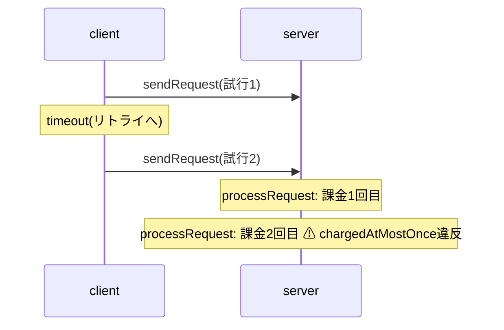

# 反例トレースの可視化検証

トレース形式(`TraceStep[]`)を凍結してよいか確認するため、実際の反例トレースを手作業でシーケンス図に起こし、足りない情報を洗い出した。素材は [examples/payment-retry.ts](../examples/payment-retry.ts) の二重課金の反例(5ステップ)。

## 反例トレース(検査器の実出力)

| # | actor | action | 状態の変化 |
|---|-------|--------|-----------|
| 0 | — | (初期状態) | `ready`, 課金0 |
| 1 | client | sendRequest | 試行1を送信、`waiting` |
| 2 | client | timeout | `ready` に戻る(試行1はネットワーク上に残存) |
| 3 | client | sendRequest | 試行2を送信、`waiting`(未達リクエスト×2) |
| 4 | server | processRequest | 試行1を処理、課金1回目 |
| 5 | server | processRequest | 試行2を処理、**課金2回目 → 不変条件違反** |

## 手起こししたシーケンス図

## 洗い出した結果

**足りていた情報**

- `actor`(アクションの実行主体)。ライフライン(縦線)への振り分けはこれだけでできる。この検証を受けて `ActionDef.actor` を追加し、検査器がトレースの各ステップへ写すようにした
- `param` と `violation.name`。ステップの注釈と違反表示はそのまま書ける
- 状態スナップショット列。ステップ間diffの導出はUI側の計算だけでできる

**足りていない情報: メッセージの矢印**

上の図で `client ->> server` の矢印を引けたのは、「`inFlight` がクライアント→サーバーのチャネルである」というドメイン知識を人間が補ったからで、トレースにもDSLにもその情報はない。トレードオフは:

- 矢印なしでも成立する表現(actorごとのレーンに並べたタイムライン+状態diff再生)なら、現在のトレースだけから完全に導出できる
- 本物のメッセージ矢印(送信と受信の対応線)を引くには、どのフィールドがどの方向のチャネルかというメタデータ(例: `channels: { inFlight: { from: "client", to: "server" } }`)が必要。DSLの意味論は変えず、`actor` と同種の可視化用メタデータの追加で足りる

## 結論

- トレース形式(`TraceStep[]`)は現状のまま凍結してよい。可視化の第1弾は「actorレーンのタイムライン+状態diff再生」とし、トレースのみを入力に作る
- メッセージ矢印付きシーケンス図はチャネルメタデータの追加で実現できる。UI実装時に必要になった時点で `channels` を足す(トレース形式への影響は送受信対応の注釈が増えるのみ)
