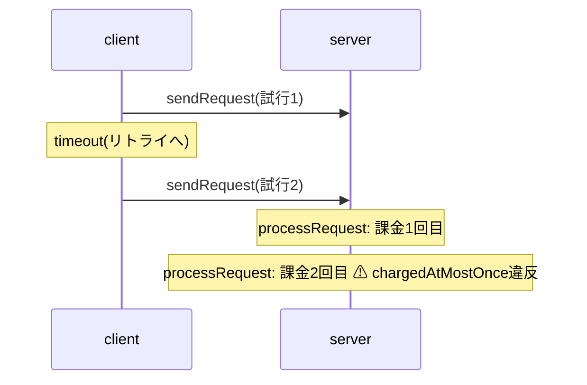

# 反例トレースの可視化検証

トレース形式(`TraceStep[]`)を凍結してよいか確認するため、実際の反例トレースを手作業でシーケンス図に起こし、足りない情報を洗い出した。素材は [examples/payment-retry.ts](../examples/payment-retry.ts) の二重課金の反例(5ステップ)。

## 反例トレース(検査器の実出力)

| # | actor | action | 状態の変化 |
|---|-------|--------|-----------|
| 0 | — | (初期状態) | `ready`, 課金0 |
| 1 | client | sendRequest | 試行1を送信、`waiting` |
| 2 | client | timeout | `ready` に戻る(試行1はネットワーク上に残存) |
| 3 | client | sendRequest | 試行2を送信、`waiting`(未達リクエスト×2) |
| 4 | server | processRequest | 試行1を処理、課金1回目 |
| 5 | server | processRequest | 試行2を処理、**課金2回目 → 不変条件違反** |

## 手起こししたシーケンス図

## 洗い出した結果

**足りていた情報**

- `actor`(アクションの実行主体)。ライフライン(縦線)への振り分けはこれだけでできる。この検証を受けて `ActionDef.actor` を追加し、検査器がトレースの各ステップへ写すようにした
- `param` と `violation.name`。ステップの注釈と違反表示はそのまま書ける
- 状態スナップショット列。ステップ間diffの導出はUI側の計算だけでできる

**メッセージの矢印には`channels`メタデータが要る**

上の図で `client ->> server` の矢印を引くには、「`inFlight` がクライアント→サーバーのチャネルである」という情報が要る。トレースの状態スナップショットだけからは導出できないため、`Spec.channels: Record<string, { from: string; to: string }>` という可視化用メタデータを追加した(DSLの意味論は変えず、`actor` と同種の追加情報)。検査器はこれを`CheckResult`(`ok: false`側)へそのまま写す。

## メッセージ矢印の判定ロジック

UI(`apps/web/src/core/messageArrows.ts` の `detectMessageArrows`)は、連続する2ステップの状態スナップショットを比較し、`channels`に登録された各フィールド(配列)の長さの増減から矢印を導出する。

- 配列長が直前より増えていれば送信(`from`が値をチャネルへ積んだ)
- 配列長が直前より減っていれば受信(`to`が値をチャネルから取り出した)
- 矢印の向き(`from→to`)は増減にかかわらずチャネル定義そのまま。送受信はそのステップで起きた事象の注釈にすぎない

`apps/web/src/ui/TraceTimeline.tsx` は各ステップカードにこの矢印注釈(例: `▶ client→server: inFlight`)を添える。`channels`未指定の仕様(order-payment等)ではこの判定が常に空配列を返すため、従来通り矢印なしのタイムライン表示になる。

## 結論

- トレース形式(`TraceStep[]`)と`channels`メタデータで、actorレーンのタイムライン+状態diff再生に加えてメッセージ矢印付きの表示ができる
- `channels`は`actor`と同じく検査結果(合否・反例の有無)には一切影響しない可視化専用のメタデータであり、指定しない仕様は従来通りに動く
